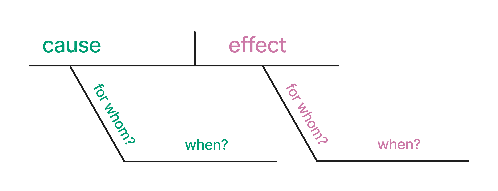
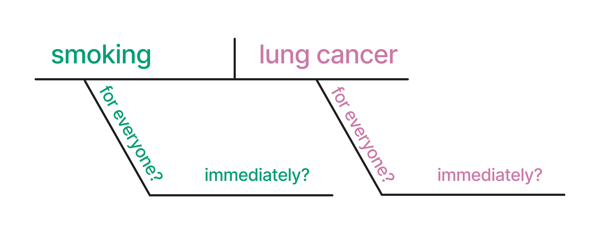
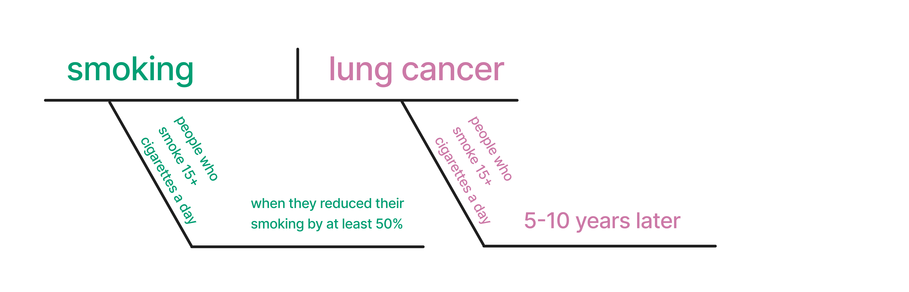
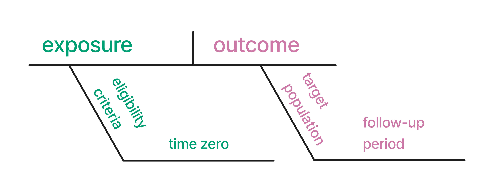

## `> who_are_we(c("lucy", "malcolm", "travis"))`

```{r}
#| label: setup
#| include: false
options(
  tibble.max_extra_cols = 6, 
  tibble.width = 60
)
```

```{css}
/*| echo: false*/
img.rounded-circle {
  height: 250px;
  width: 250px;
  border-radius: 50%;
}
```

:::: {.columns}

::: {.column width="33.3%"}
<br />
<br />


::: {.small}
<br />
<br />
&nbsp;&nbsp;&nbsp;&nbsp;&nbsp;&nbsp;&nbsp; [https://www.lucymcgowan.com/](https://www.lucymcgowan.com/)
:::
:::

::: {.column width="33.3%"}
<br />
<br />

::: {.small}

<br />
&nbsp;&nbsp;&nbsp; [https://www.malco.io/](https://www.malco.io/)
:::
:::


::: {.column width="33.3%"}
<br />
<br />


::: {.small}
<br />
<br />
<br />
[https://travisgerke.com/](https://travisgerke.com/)
:::
:::

::::


## The three practices of analysis {background-color="#23373B"}

1. Describe
2. Predict
3. Explain (causal inference)

## {background-color="#23373B" .center}

> Our results suggest that "Schrödinger's causal inference," where studies avoid stating (or even explicitly deny) an interest in estimating causal effects yet are otherwise embedded with causal intent, inference, implications, and recommendations, is common.

::: {.small}
Haber et al., *American Journal of Epidemiology*, 2022
:::

## Causal language in health research {background-color="#23373B"}

- Only around **1%** of studies used the root word "cause" at all
- A **third** of studies had action recommendations
- Researchers rated **80%** of those recommendations as having at least some causal implication

## {background-color="#23373B" .center}
### Normal regression estimates associations. But we want *counterfactual, causal* estimates: 
<br />

### What would happen if *everyone* in the study were exposed to x vs if *no one* was exposed.


## {background-color="#23373B" .center}
### For causal inference, we need to make sometimes unverifiable assumptions. 

<br />

### Today, we'll focus on the assumption of *no confounding*.

## Diagramming a causal claim



## Does smoking cause lung cancer?



## A more specific causal claim



## Causal analysis terminology



## {background-color="#23373B" .center}
### Does the answer match the question?

<br />

### *For people who smoke 15+ cigarettes a day, does reducing smoking by 50% reduce the lung cancer risk over 5-10 years?*

## Tools for causal inference {background-color="#23373B"}

::: {.small}
- **Causal diagrams**: state our assumptions about the causal structure
- **Propensity score weighting**: reweight units to create a pseudo-population where exchangeability holds
- **Propensity score matching**: find comparable treated and untreated units
- **G-computation**: fit an outcome model, then marginalize over the covariates
- **Doubly robust methods**: fit both models; only one needs to be correct. Includes TMLE
:::

## Tools that make other assumptions {background-color="#23373B"}

::: {.small}
- **Instrumental variables**: a variable affects the treatment but does not directly affect the outcome except through the treatment
- **Regression discontinuity**: a cutoff determines who gets the treatment, and individuals just above or below it are comparable
- **Difference-in-differences**: the treated and untreated groups would have followed the same trend without the treatment
- **Synthetic controls**: a weighted combination of untreated units approximates the treated unit's outcome without the treatment
:::

## Resources {background-color="#23373B"}
### [Causal Inference in R](https://www.r-causal.org/): Our book! Free online.
### [Causal Inference](https://www.hsph.harvard.edu/miguel-hernan/causal-inference-book/): Comprehensive text on causal inference. Free online.
### [The Book of Why](http://bayes.cs.ucla.edu/WHY/): Detailed, friendly intro to DAGs and causal inference. 
### [Mastering 'Metrics](http://www.masteringmetrics.com/): Friendly introduction to IV-based methods
